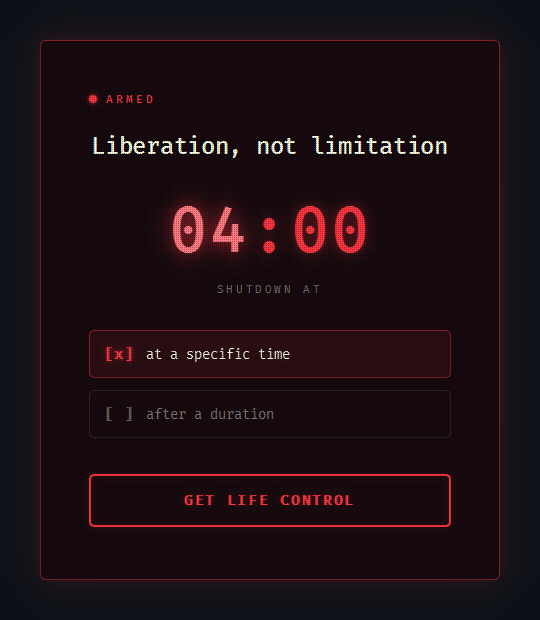
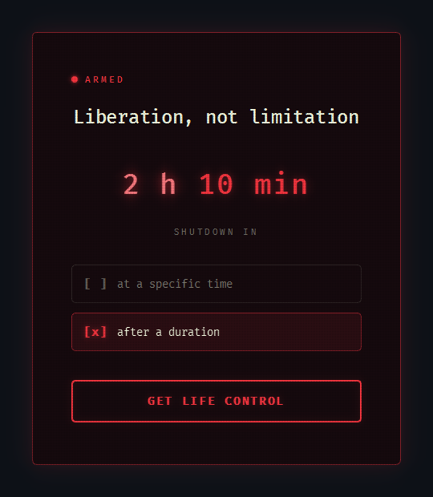

# Life Control Button
A simple app that helps you schedule your PC shutdown time. Run while starting a coding or gaming session and make sure you don't end up going to sleep at 3 AM. You can also make it run at system startup (see below) to make sure you don't end up binging. Get the zip from the [release page](https://github.com/NakerTheFirst/Life-control-button/releases/latest) and extract it anywhere - the exe sits at the top of the folder.

<br>
<p align="center">&nbsp;</p>
<p align="center">Life Control Button GUI</p>

## Features
* Schedule PC shutdown at a set time
* Schedule PC shutdown after set duration
* Glowing ember theme with a drifting CRT scanline texture
* Clean, minimalist interface
* Live countdown if you reopen the app while a shutdown is already pending
* Register the app to run at every system startup with a single flag
* Hit the Life Control Button via enter (wow!)
* Full keyboard navigation: up/down arrows adjust the value, right/left jump between sections, Tab moves through the controls

## Requirements
* Python 3.10+
* PyQt6

## Installation & Usage
1. Clone this repository:
  ```bash
  git clone git@github.com:NakerTheFirst/Life-control-button.git
  ```
2. Install the dependencies:
  ```bash
  pip install -r requirements.txt
   ```
3. Run the application (`pythonw` avoids opening a console window):
  ```bash
  pythonw main.py
  ```

Select your preferred shutdown mode:
* Choose "at a specific time" to set a target time
* Choose "after a duration" to set a countdown

Click "Get Life Control" or press Enter to schedule the shutdown.

## Run at startup
The app can register itself to launch at every logon - no Task Scheduler needed:
```powershell
.\LifeControlButton.exe --install-startup
```
Undo it with `--uninstall-startup`. Both write only to the per-user registry, so no admin rights are required.

Note: Windows marks downloaded files as coming from the internet, and SmartScreen silently blocks marked exes at logon. Unblock the zip before extracting it (right-click it, Properties, tick "Unblock", or run `Unblock-File LifeControlButton.zip` in PowerShell), otherwise the app will not start with the system.

## Note
This application uses the native Windows `shutdown` command (Windows 10 and 11), so Linux and Mac are unsupported. There is deliberately no cancel button. Feel free to contribute.
